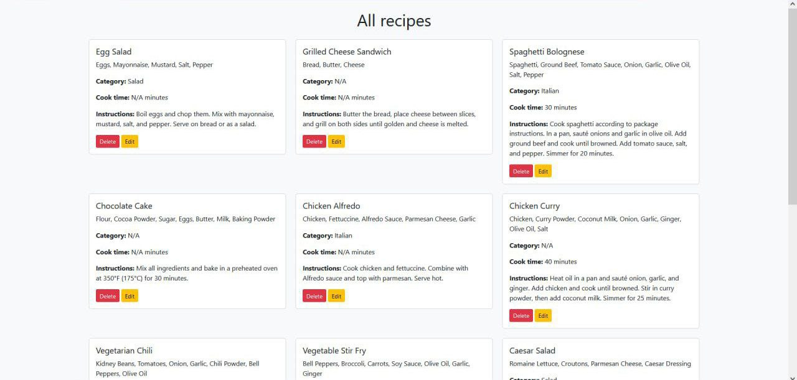
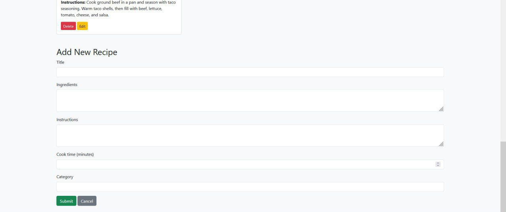
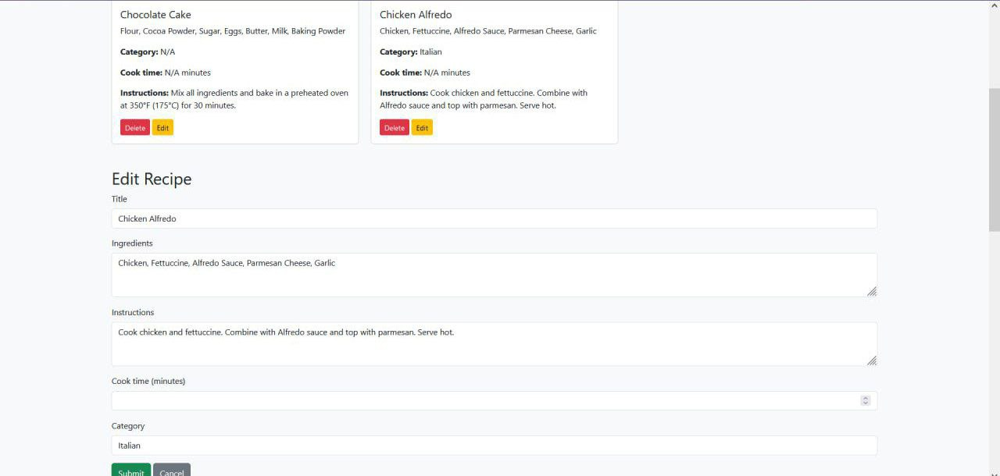

# Recipe Hub

This project is an educational pet project designed to practice CRUD functionality. It allows users to view, add, edit, and delete recipes, providing a simple but efficient interface to manage a collection of recipes.

<div align="center">
  
  
  
</div>

---

- [Technology](#technology)
- [Requirements](#requirements)
- [Usage](#usage)
  - [Open site](#open-site)
  - [Initialize MySQL](#initialize-mysql)
- [Architecture](#architecture)
  - [API](#api)
  - [Database](#database)
  - [Reverse proxy](#reverse-proxy)

## Technology
- Frontend: HTML, CSS, JavaScript, Bootstrap
- Backend: PHP, Apache, REST API
- Database: MySQL, PhpMyAdmin
- Containerization: Docker, Docker Compose
- Reverse proxy: Nginx
- *Optional: [Python](#initialize-mysql)

## Requirements
- Docker and Docker Compose: to run the site
- Python (Optional): for initial MySQL configuration

## Usage
### Open site
1. Move to the project folder
2. Run docker compose: `docker compose up -d`
3. Open a browser and go to the website `localhost`
### Initialize MySQL
Why: Creates a table in MySQL and populates it with the original data
- **Linux**:
```
~ $ python -m venv venv
~ $ .\venv\Scripts\activate.bat
~ $ pip install -r requirements.txt
~ $ python initdb.py
```
- **Windows**:
```
~ $ python -m venv venv
~ $ source venv/bin/activate
~ $ pip install -r requirements.txt
~ $ python initdb.py
```

## Architecture
### API
- GET `localhost/api/recipes` - retrieve a list of all available recipes.
- POST `localhost/api/recipes` - add a new recipe to the database by providing details such as title, ingredients, instructions, cooking time, and category.
- PUT `localhost/api/recipes/{id}` - modify the details of an existing recipe using its ID.
- DELETE `localhost/api/recipes/{id}` - remove a recipe from the database by its ID.
### Database
The project uses **MySQL** as the database management system to store and manage recipes. The **MySQL** service is running on port `3306`, and all data related to recipes (such as title, ingredients, instructions, etc.) is stored here.

For easy database management and administration, **phpMyAdmin** is included as a web-based interface. It’s accessible via port `8081`, providing a user-friendly environment to interact with the **MySQL** database.
### Reverse proxy
**Nginx** - used as a reverse proxy, redirects requests:
  - `/` → to frontend (static files)
  - `/api/` → to the backend (PHP API)